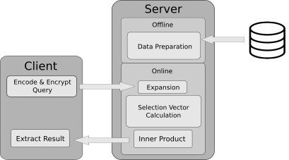

# Constant-weight PIR

Implementation of Constant-Weight Private Information Retrieval Using Constant-weight Equality Operators

## Overview

This repository contains the experimental implementation of Constant-weight PIR using constant-weight equality operators proposed in the [paper](https://arxiv.org/abs/2202.07569). The following figure shows the main steps of the protocol.

<p align="center">
  
</p>

We also implement folklore PIR as described in the paper. Furthermore, we provide impelementations of the equality operators proposed in the paper for the purpose of benchmarking.

## Dependencies
The project requires the following dependencies:
* GNU G++ (version >= 6.0)
* Microsoft SEAL (version >= 3.6)

[Microsoft SEAL](https://github.com/microsoft/SEAL) can be installed, locally or globally, using the [instructions](https://github.com/microsoft/SEAL#building-microsoft-seal) outlined in the repository.

## Building the Project
The project can be built using the following command in ```src/build```
```
cmake ..
make 
```

If SEAL is not in your path or installed locally, you can use the following command
```
cmake .. -DCMAKE_INSTALL_PREFIX=[PATH TO SEAL]
make
```
where [PATH TO SEAL] is the path to the SEAL library installed on your machine.


## Functionality
The ```./main``` executable accepts the following parameters


Parameter                   | Function                                                                                            | Default 
:-------------------------: | :-------------------------------------------------------------------------------------------------: | :--------------------:
--num_keywords              | Number of keywords in the database                                                                  | 100
--eq_type                   | Type of equality operator to use (0: Folklore, 1: Constant-weight)                                  | 1 : Constant-weight
--hamming_weight            | Hamming weight of the constant-weight code (applicable when the constant-weight operator is used)   | 2
--log_poly_mod_degree       | Logarithm of the polynomial modulus degree in SEAL                                                  | 13
--keyword_bitlength         | Bitlength of the keywords (i.e. The bitlength of elements in the domain)                            | ceil(log2(num_keywords))
--response_bytesize         | Byte size of the payload data in each row of the database                                           | one plaintext
--verbose                   | Verbosity flag                                                                                      | true
--write_path                | Path of the directory in which the results are written (the name of the file is a random number)    | None
--num_threads               | Number of threads to use (0: Use all threads available, max parallelization)                        | 0

## Examples
```
./main --num_keywords=100 --hamming_weight=2
./main --num_keywords=100 --hamming_weight=8 --log_poly_mod_degree=14
./main --num_keywords=10 --hamming_weight=2 --response_bytesize=2000
./main --num_keywords=10 --hamming_weight=2 --write_path=results/
```


## Benchmarking Equality Operators

The ```./benchmark_eq``` can be used to benchmark an equality of the following types: folklore plain (fl-plain), folklore arithmetic (fl-arith), folklore binary (fl-bin), constant-weight plain (cw-plain), constant-weight arithmetic (cw-arith), and constant-weight binary (cw-bin).
The executable accepts the following parameters (the requried inputs depends on the type of equality operator)


Parameter                   | Function                                                                                            | Default 
:-------------------------: | :-------------------------------------------------------------------------------------------------: | :--------------------:
-d       | Logarithm of the polynomial modulus degree in SEAL                                                  | 13
-l         |  Bitlength of elements in the domain                            | -
-m              | Length of Constant-weight Code (derived automatically if the bitlength of elements is given)                                                                  | -
-k            | Hamming weight of the constant-weight code (applicable when the constant-weight operator is used)   | 2
-p       | Whether to run in parallel or not | false
-w                | Path of the directory in which the results are written (the name of the file is a random number)    | -
-v         | Batched comparisons  | true

## Testing

The repository is tested using the [googletest](https://github.com/google/googletest) framework. For building and running tests, run the following commands
```
cd tests
git clone https://github.com/google/googletest.git
mkdir build
cd build
cmake .. -DCMAKE_INSTALL_PREFIX=[PATH TO SEAL]
make
./tests
```

## Examples
```
./benchmark_eq fl-plain -l 8
./benchmark_eq fl-arith -l 16 -d 14 -p -v
./benchmark_eq cw-plain -k 2 -l 32 -p
./benchmark_eq cw-arith -k 3 -w results-eq/ -p -v
```


## Experimental Results
The results shown in the paper can be reproduced using the implementation in this repository. The instructions reproduce the results are in the `src/build` directory